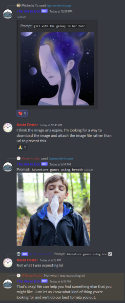
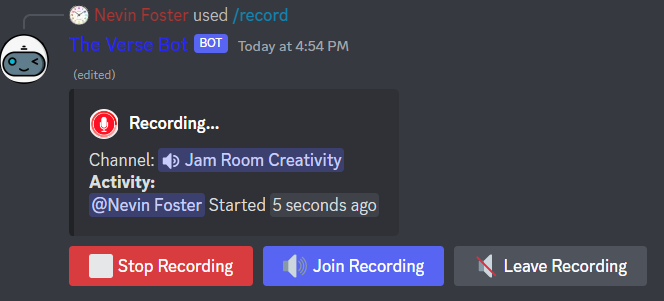
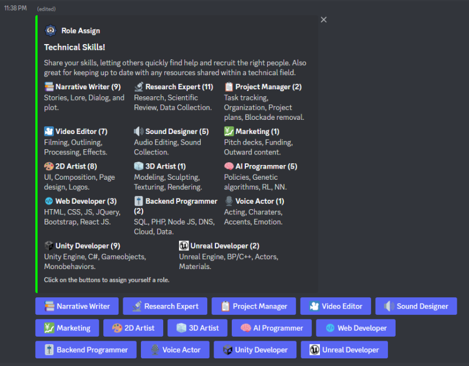
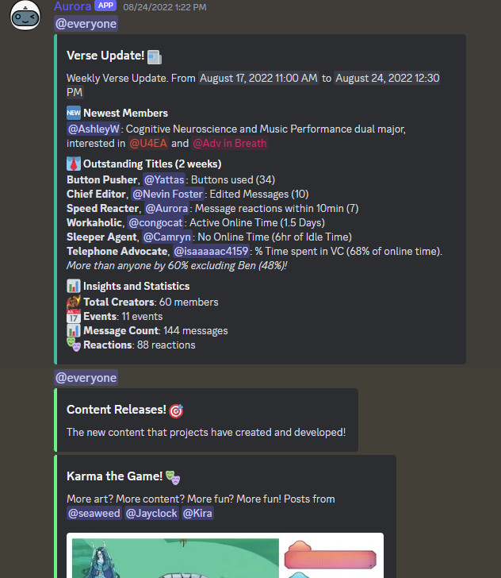
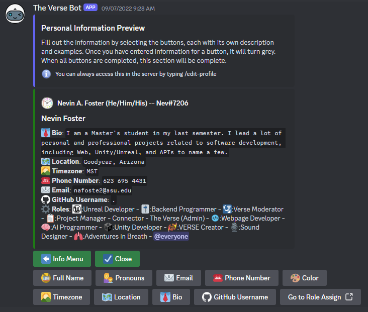

The Verse Bot (Aurora)
======================

Aurora is a multi-purpose discord bot used for: recording meetings, managing member roles, onboarding new members, and much more!

## The Bot is Alive!

Using Openai and the free APIs that they offer, I was able to add some fun features to mess around with on the bot.

First, if you reply or "@" mention the bot in a message, the bot will use openai to generate a response.
Second, if you use the command /generate-image, the bot will create an image using a prompt.
See ⁠off-topic for some examples

Both of these are for fun and most likely won't serve an outstanding purpose. Usage is limited but feel free to use as much as you want. Once the credits are out, the bot will just fall back to a default response, no harm done.

## Recording Meetings!

Want to record a meeting but not a fan of the setup? Use /record to begin a recording in the channel that you are in! The audio quality is pretty great and this will automatically upload and share the recording to whatever channel it was started in.

Notes on the feature:
◽ You must hit the Join Recording Button to be recorded. (implemented for consent)
◽ Go to ⁠unknown and select "Auto Join Recordings" if you don't want to have to join each time.
◽ Recordings have no video as discord API is incompatible.
◽ By default, recordings will cut out all pauses: audio when no one is talking. Keeps the videos from being filled with pauses when everyone is muted.
◽ Only one recording can be active at a time. This is because the discord bot can only be in one channel at a time, and the limitation is a common problem.
◽ Records are limited to 2 hours and will notify you when the time is almost up. If you want to record longer, stop and start recordings at convenient breaks or whenever needed.

## Weekly Updates

Weekly messages are sent using collected statistics and commands used over the week. All information is automatic and unmanaged. Includes things like new members, fun weekly titles (like Button Pusher), any new tagged content, and shoutouts. This screenshot is only a fraction of the whole message.

## Onboarding New Members!

The Verse Bot (self-named Aurora) is capable of DMing anyone interested in joining the full-access server and having them fill out needed information to automate as much management as possible. Any admins will get a full request form in a channel and can directly add people with a click-of-a-button.

## Role Assign!

Our ⁠⚒︱roles-under-construction channel is now back in business! For any old members, this functions the same as before, with a slight update to the look.
For all new members, check out the channel and see if there are any projects/skills that you want to join. To add yourself to any role or channel, just click the button. You'll get a message afterward stating if the roles were added or removed. If you are not sure what roles you have, you can click your name in discord and the pop-up will display all of your roles.

## Get Time Chat Command

/get-time command: Having trouble figuring out the time zones and making meeting times clear? /get-time lets you pass in a phrase that will be converted into timestamps that automatically convert to match the timezone of each individual user

[Example Video](docs/GetTimeCommand.webm)

## Create Event From Message

Create Event From Message: If you right-click any message, you can select Apps -> Create Event to start creating an event, using the messages times and description as default values for the event form

[Example Video](docs/EventFromMessage.webm)

## Create Event Chat Command

/create-event creates a Google Calendar event and Discord Event using a nice popup. Fill in the time with the command to get a preview of the time to make sure you get it right. 
After you submit the form, you'll get a message with the event info and link. From here, you can then send a message to the channel which will let you share with the others the event and links. It can sometimes take a few seconds to create the discord event, so either give it some time between tries or check the event-notifications  channel to see when it's scheduled.

[Example Video](docs/CreateEventCommand.webm)

## Creating Polls!

/create-poll lets you create a poll which people can vote on. You have options to make it anonymous or limit the number of times people can vote as well as up to 9 voting options.

[Example Video](docs/Create_Poll.mp4)

## Gratitude Shoutouts!

/gratitude-shoutout will let you create a spot light shout out for any special team members. If anyone has helped you or you think is working hard, please send them some words of gratitude!

[Example Video](docs/Grats_Shoutout.mp4)

## Music Shoutouts!

/music-shoutout is a fun way to share the songs that you love. Find yourself jamming out or singing along to a song? Post it in The Verse to share the fun!

[Example Video](docs/Music_Shoutout.mp4)

## List Role's Members

Looking for someone with a given skill, or perhaps seeing who is missing from a meeting? Use /list-role-members to print all members that have a given role!

[Example Video](docs/List_Role_Members.mp4)